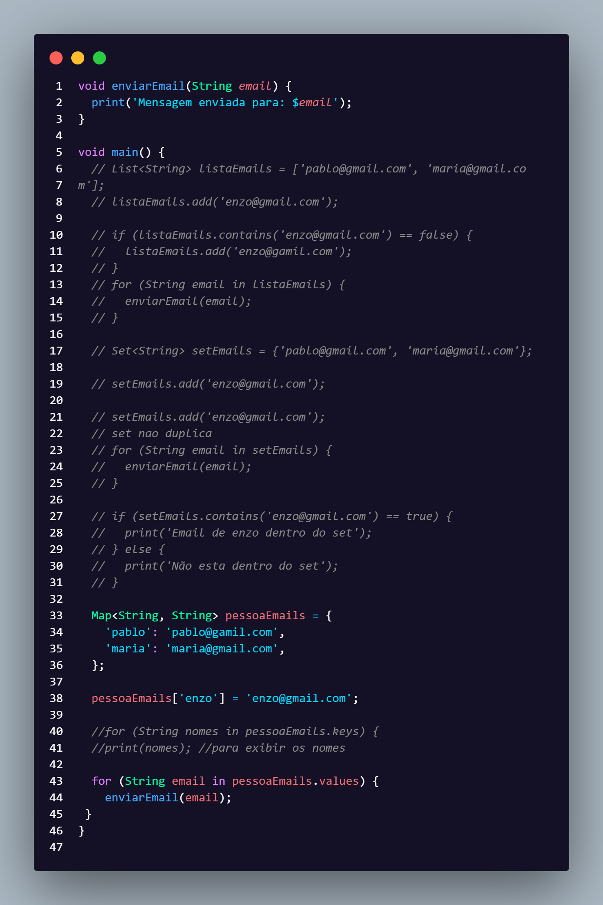

# Prática com Listas, Sets e Maps em Dart

Este repositório contém um exercício em **Dart**, baseado em aulas da **Alura**, que demonstra como trabalhar com **listas, conjuntos (sets)** e **mapas (maps)** para manipulação de e-mails.

## 🚀 Tecnologias
- [Dart](https://dart.dev/)

## 📚 Conteúdo do Código
O programa mostra como:
- Criar e manipular uma **List** (`List<String>`) de e-mails.
- Utilizar um **Set** (`Set<String>`) para evitar duplicações.
- Criar um **Map** (`Map<String, String>`) para associar nomes a e-mails.
- Iterar sobre listas, sets e maps.
- Usar funções simples em Dart (`enviarEmail`) para simular o envio de mensagens.

